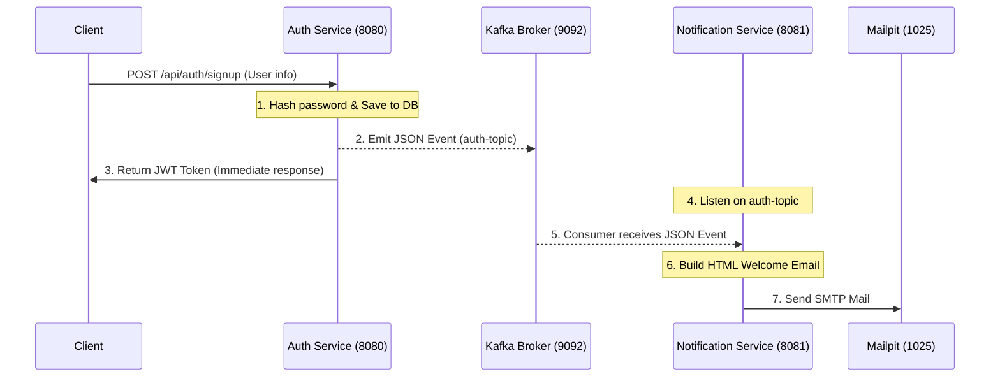

# Learning Backend From Scratch: Event-Driven Microservices

A structured implementation of a highly scalable, event-driven microservices architecture using Spring Boot, Apache Kafka, and PostgreSQL.

This repository documents the progression from foundational REST API development to a distributed systems model. It demonstrates the decoupling of domain logic (like user authentication and JWT validation) from asynchronous processes (like notification delivery) using an internal event bus.

---

## 🏗️ Architecture & Tech Stack

This project utilizes a modern Java ecosystem and self-managed message brokers to ensure high throughput, security, and data integrity.

* **Core Framework**: Java 25 / Spring Boot 3.x (utilizing parent configuration)
* **Microservices**:
  * **Auth Service** (Port `8080`): Handles user registration, database persistence, and stateless authentication.
  * **Notification Service** (Port `8081`): A fully decoupled listener service that consumes events and handles email delivery.
* **Data Persistence**: PostgreSQL via Spring Data JPA / Hibernate.
* **Security & Authentication**: Spring Security + JWT (JSON Web Tokens) with a custom `JwtAuthenticationFilter` providing stateless token verification.
* **Global Error Handling**: Standardized controller advices transforming system errors into clean `ApiError` responses.
* **Event Streaming**: Apache Kafka (KRaft mode, eliminating ZooKeeper dependencies).
* **SMTP Sandbox**: Mailpit running in Docker to capture and inspect mock welcome emails in a web-based GUI.
* **Infrastructure**: Docker & Docker Compose.
* **Boilerplate Reduction**: Lombok.

---

## ⚙️ System Components & Flow



---

## 🚀 Local Development Setup

### Prerequisites
* JDK 25 or higher
* Maven 3.8+
* Docker Desktop / Docker Engine

### 1. Infrastructure Provisioning
Spin up PostgreSQL, Apache Kafka, and Mailpit using Docker Compose:
```bash
docker compose up -d
```
Access the mock email inbox in your browser at `http://localhost:8025`.

### 2. Running the Microservices
1. **Start the Auth Service**:
   ```bash
   cd kafka
   mvn clean spring-boot:run
   ```
2. **Start the Notification Service**:
   ```bash
   cd ../notification-service
   mvn clean spring-boot:run
   ```

---

## 🧪 Testing the Flows

### 1. User Registration (Signup)
Create a new user. The system will persist the user, publish a Kafka event, and return a JWT token.
```bash
curl -X POST http://localhost:8080/api/auth/signup \
     -H "Content-Type: application/json" \
     -d '{
           "name": "Jane Doe",
           "email": "jane.doe@example.com",
           "password": "securepassword123"
         }'
```
*Check `http://localhost:8025` to see the welcome email in Mailpit!*

### 2. User Authentication (Login)
Retrieve a stateless JWT bearer token:
```bash
curl -X POST http://localhost:8080/api/auth/login \
     -H "Content-Type: application/json" \
     -d '{
           "email": "jane.doe@example.com",
           "password": "securepassword123"
         }'
```

### 3. Accessing Protected Endpoints
To access endpoints under `/api/users/**`, include the bearer token returned from login/signup in the headers:
```bash
curl -X GET http://localhost:8080/api/users/all \
     -H "Authorization: Bearer <PASTE_YOUR_JWT_HERE>"
```

---

## 🗺️ Roadmap / Backlog
* [x] Establish base Spring Boot project and JPA configurations.
* [x] Implement secure User entity mapping and PostgreSQL integration.
* [x] Configure Auth Controller and BCrypt password hashing.
* [x] Provision Kafka KRaft cluster via Docker Compose.
* [x] Implement Kafka Producer for asynchronous registration events.
* [x] Implement Kafka Consumer for email delivery integration.
* [x] Transition to JWT-based stateless session management.
* [x] Introduce global exception handling and standardized API error responses.
